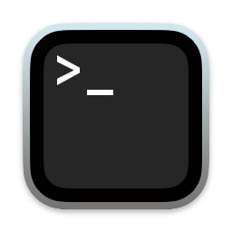
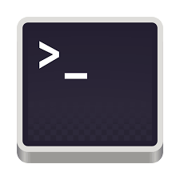
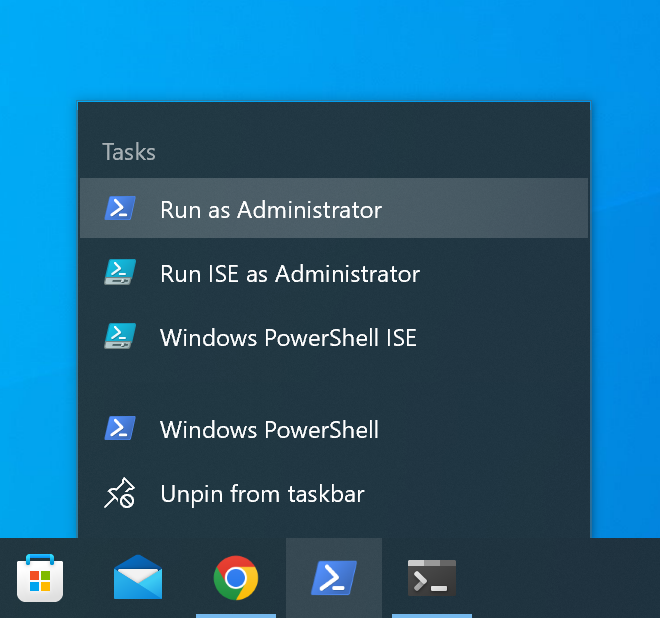
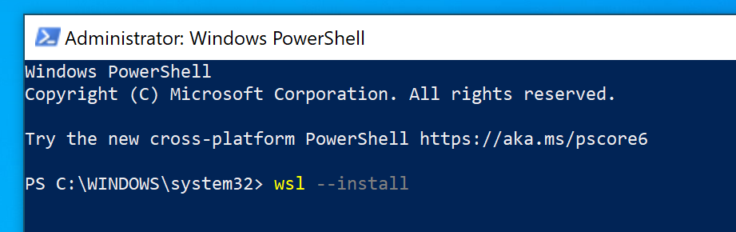

# Computer preparation

### April 24, 2023

*Egon A. Ozer, MD PhD (<e-ozer@northwestern.edu>)*  
*Ramon Lorenzo Redondo, PhD (<ramon.lorenzo@northwestern.edu>)*  

---

# Prerequisites
The exercises we will be performing are designed to be easily and quickly run on laptop computers and the software installation requirements are minimal. If you are using an administrator-managed computer, you may need to get permission from IT to install the required software.
 

System | Minimum Requirements
--- | ---
MacOS | Version 10.13 or higher; 64-bit
Windows | Window 10 version 2004 (Build 19041) or higher or Windows 11; 64-bit
Linux | Ubuntu, RedHat, CentOS 7+ or others; 64-bit

_Don't try to use a tablet device like an iPad or Android!_ There may be hacks that allow for the installation of some of this software, but it's WAY out of the scope of this workshop and we don't recommend it. 

---
# Step 1 - Install Applications

This workshop will use a combination of **visual** (otherwise known as GUI or "point-and-click") software applications and **command-line** (or text or terminal) programs. We'll start by installing a few useful visual programs.

### Step 1.A - Tablet  

[Tablet](https://ics.hutton.ac.uk/tablet/) is a program that can be used to visualize and analyze read-based alignments against a reference sequence. 
 
* To install, go to this website: [https://ics.hutton.ac.uk/tablet/download-tablet/](https://ics.hutton.ac.uk/tablet/download-tablet/) to download and install the software appropriate for your system.

### Step 1.B - FigTree  

[FigTree](http://tree.bio.ed.ac.uk/software/figtree/) is a program to view phylogenetic trees. Files that can be viewed in FigTree generally end with the suffix `.tre` or `.nwk`.  

* To install, download the most recent version (v1.4.4) from this website: [https://github.com/rambaut/figtree/releases](https://github.com/rambaut/figtree/releases). 
* If you have a Mac, download the file ending with `.dmg`. Create a new folder in your Applications folder and drag all of the files into that folder.
* If you have a PC, download the file ending with `.zip`. Double-click and move all of the files into a new folder
* If you have Linux, download the file ending with `.tgz`. Double-click and move all of the files into a new folder.

### Step 1.C - SeaView  &nbsp;

[SeaView](http://doua.prabi.fr/software/seaview) is a program that can view and generate multiple sequence alignments of DNA and protein sequence as well as multiple other functions.

* To install, download the correct version for your computer from here: [http://doua.prabi.fr/software/seaview](http://doua.prabi.fr/software/seaview) and follow the instructions on that site for proper installation. 
* On Macs, you'll probably get a security alert when you try to open the program for the first time. To override this (it's OK!) open your _System Preferences_, click the _Security & Privacy_ icon, then click "Allow" next to SeaView in the window. Should be good to go.

### Step 1.D - R and RStudio  &nbsp;  

R is a statistical and graphics programming and analysis software with several other applications in analysis of genomics data. RStudio is a an application for programming and running R code. You will also need to install both, but you can either do this now or we will do it later in the workshop.

* R code downlad and installation. Do this before installing RStudio. [https://cran.rstudio.com/](https://cran.rstudio.com/)
* RStudio software download and installation instructions: [https://www.rstudio.com/products/rstudio/download/](https://www.rstudio.com/products/rstudio/download/)


### Step 1.E - Terminal  &nbsp;  &nbsp;   

You shouldn't need to install this. A Terminal program comes pre-installed on MacOS, Windows 10 and up, and Linux distributions. Please take this opportunity to search for your Terminal program on your own system as you will need it for the next step.  

---

# Step 2 - Windows only: Install Windows Subsystem (WSL) for Linux

As most bioinformatics software for genomics is written and optimized for Unix-based systems like Linux and MacOS, WSL will allow you to run this software natively on a Windows PC. This software requires administrator access to install. See computer requirements table above for minimum PC system requirements before starting. For more information about installing and using WSL beyond what we are doing here, you can look [here](https://docs.microsoft.com/en-us/windows/wsl). 

### Step 2.A - Open PowerShell

Make sure that you run PowerShell as an administrator.  


### Step 2.B - Install WSL

Type `wsl --install`. That's it.  



WSL by default currently automatically installs Ubuntu Linux 20.04. That will be perfect for our purposes, but can be changed 

### Step 2.C - Start WSL

In PowerShell, type `wsl` on the command line. The first time it starts up it may take a few minutes to decompress files and set up. You will also have to set a username and maybe a password. You can set both to whatever you want. They can be the same as your Windows name and password, but don't have to be.

### Step 2.D - Add your WSL home folder to your Explorer favorites

WSL sets up a separate home folder for Ubuntu. We'll be doing most of our work in this home folder, so you will want to keep track of where it is in Windows.

1. Open your Windows explorer from the command line: `explorer.exe ~` (tilde sign at the end)
2. Drag the folder location into your favorites sidebar in the Windows explorer.


# Step 3 - Mac only: Install Xcode command line tools and Homebrew

In the Mac terminal, run the following command:

```Shell
xcode-select --install
```

The download and installation will take several minutes. Test the installation after download with the following command:

```Shell
xcode-select -p
```

The installation was successful if the output is something like this:

```Shell
/Library/Developer/CommandLineTools
```

[Homebrew](https://brew.sh/) is a software installation service for the Mac. Installing Homebrew is optional for this workshop, but may help you more quickly get around any problems with missing software on different implementations and versions of Mac OS that could unexpectedly come up. It's nice to have it if you need it.

To install:

```Shell
/bin/bash -c "$(curl -fsSL https://raw.githubusercontent.com/Homebrew/install/HEAD/install.sh)"
```

Easy!


---

# [Back to table of contents](../README.md)

---

<a rel="license" href="http://creativecommons.org/licenses/by-sa/4.0/"></a><br />This work is licensed under a <a rel="license" href="http://creativecommons.org/licenses/by-sa/4.0/">Creative Commons Attribution-ShareAlike 4.0 International License</a>.


  