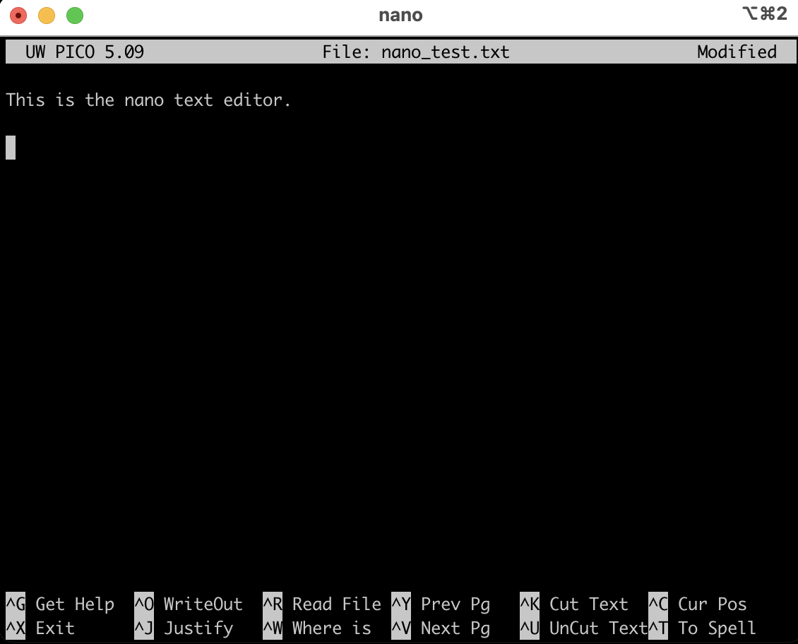

# Command Line Basics

### August 2022

*Egon A. Ozer, MD PhD (<e-ozer@northwestern.edu>)*  
*Ramon Lorenzo Redondo, PhD (<ramon.lorenzo@northwestern.edu>)*  

---

# Section 1 - Basic command line functions

This section is to introduce you to basic operations in the command line. 

## Section 1.1 `ls`

The `ls` command is used to list the contents of a directory. If you use the `ls -l` command, you'll get a lot more information about the contents such as whether an item is a file or directory and how big the file is, etc.


## Section 1.2 `cd`

The `cd` command is used to change directories. 

* If you type `cd <directory name>` you'll move into that directory
* You can use `cd ..` (two periods) to move back up one directory
* You can move down multiple directories by listing the path you'd like to take. For example:`cd directory1/directory2/directory3` 
* Most terminal programs will allow you to drag a file or folder into the terminal. So if you'd like to cd into a folder in your Finder window, for example, you can type `cd ` (followed by a space) in your terminal, then use your mouse to drag the folder into the Terminal window and hit Enter. 

## Section 1.3 `pwd`

The `pwd` command will tell you your present working directory. Helps keep you from getting lost sometimes.  

## Section 1.4 `mkdir`

The `mkdir` command will create a new directory. For example, if you want to create a directory called "output" in your current directory, just type `mkdir output`

## Section 1.5 `cat`

The `cat` command is short for "concatenate", but it's mostly used for displaying a text-based file to your terminal window. Careful, this command dumps the entire contents of the file to your Terminal so if it's a large file (like a genome sequence file, for example), it could take a while to print everything. Unless the file you are looking at is very short, you may be better off using `less` (described below).

## Section 1.6 `less`

The `less` command allows you to look at the contents of a file in your Terminal without printing the whole thing at once.

* You can either use `less` and the name of the file (i.e. `less genome.fasta`) or you can pipe the output of another command to `less` using the **pipe character** "|" to explore it in a controlled way (i.e. `cat genome.fasta | less`)
* Use the **arrow keys** to scroll up or down one line at a time or use the **space bar** to scroll down several lines at a time 
* To exit the `less` screen, hit the `q` key (without shift)

## Section 1.7 Redirect `>`

If you want to direct the output of a command that usually prints to the screen to a file instead, just use the redirect character `>` at the end of the command and type a file name to direct the file to.

* Example: `cat genome.fasta > new_file.fasta`
* **WARNING**: If you redirect to an existing file, it will be overwritten by the new file. The overwritten data will not be able to be recovered. 

To addend a file, i.e. to add new data to the end of the file wihtout overwriting the old data, you can use the `>>` redirect instead.  

## Section 1.8 `cp`

This is the copy function. It allows you to make a copy of a file in a new name and/or new locataion. The usage is: 

```
cp <original file name> <new file name>
```

## Section 1.9 `mv`

The `mv` function can be used either for moving a file or directory to a new location or to rename a file or directory. The usage for moving the file is:

```
mv <current file location> <new file location>
```
Usage for renaming the file is:

```
mv <file> <new_file_name>
```

## Section 1.10 `ln`

The `ln` function creates a symbolic link or "symlink" of a file or directory. This creates a pointer to a file's location. This allows you to make "copies" of a file or directory in a new place without taking up space.

Usage is:

```
ln -s <original file> <name and location of new file>
``` 

Be careful with symbolic links. If the original file that the symlink is pointing to moves or is deleted, the symlink will become non-functional. 


## Section 1.11 `rm`

`rm` deletes files or folder

 Be very careful with the `rm` function. There is no recycle bin or trash can that files go into before deletion. There is way to recover a file or folder that has been deleted with `rm`. When it's gone, it's gone.

Usage:

```
rm <file to be deleted>

rm -r <directory to be deleted>
```

## Section 1.12 `|`

The `|` is the "pipe" character. It is used to string commands together such that the output of one command becomes the input to the next command.

Here is a simple example of three commands piped together:

```Shell
echo "B C A" | tr " " "\n" | sort
```

This prints the letters "B C A", translates the spaces (`" "`) into new lines or returns (`"\n"`) and then sorts the resulting list alphabetically such that the output of this command is: 

```
A
B
C
```

Piping is a good way to save time or easily execute complex commands. In later exercises we'll also show how this approach can save storage space by skipping the creation of large intermediate files.

---

# Section 2 - Useful applications

## Section 2.1 `gzip`

Gzip compression software is not necessarily a standard program, but is so widely distributed that it's more likely than not that it is part of your distribution. It comes standard on Mac and almost all flavors of Linux. Gzip is used to compress files to save space and decompress them when needed.

* Gzipped files usually end with the `.gz` suffix
* Sequence read files are almost always gzipped and it's best to leave them this way. Most software that uses sequencing reads can automatically decompress them as needed.
* To gzip file, just use the command `gzip <file>` The output file will be named the same as the input file, but with a `.gz` suffix
* To take a quick peek at a gzipped file, you can string a few commands together. For a read file named "reads_1.fastq.gz" you use this command: `gzip -cd reads_1.fastq.gz | less`. The `-cd` setting is actually two settings together, `-d` to decompress (rather than the default compress) and `-c` tells the program to output the decompressed file to the Terminal. You can then pipe that output to `less` 

There are lots more commands we don't have time to go through at this point (like the necessary, but potentially very dangerous `rm` command), but the more you work in this space, the more you'll pick these commands up.

## Section 2.2 `screen`

One way to run concurrent programs or functions in the command line environment is to use terminal application that has the option to open multiple tabs. Another is to use the `screen` application. This allows you to open multiple virtual terminals within your current session. 

The real benefit of `screen` is when running processes on remote computers or servers. Applications running in a `screen` session will continue even if you disconnect from the server.

The `screen` application should be standard on Ubuntu 18 and 20, most other flavors of Linux, as well on Mac. 

* To start a session: `screen`  


 WARNING: The first time you start `screen` you may see an error message that looks like this:

```
Cannot make directory '/run/screen': Permission denied
``` 

If you see this, run the following commands:

```Shell
mkdir ~/.screen
chmod 700 ~/.screen
echo "export SCREENDIR=$HOME/.screen" >> ~/.bashrc 
```

Then exit and restart your terminal. Should work now.

* To disconnect from a screen session, but leave it running in the background: `ctrl+a` then `d` to "detatch"
* To reconnect to a detatched screen session: `screen -a`. If you have multiple screen sessions going, it will prompt you to enter the ID number of the session you want to reattach.
* To exit from a screen session and end the session: `exit`

## Section 2.3 `top` or `htop`

These commands provide information on processor and memory usage on your system. Can be useful to get a sense of how many resources are being used, especially if you would like to run parallel processes in separate tabs or in `screen`

`top`: present on nearly all Linux or Mac systems. Very basic information


`htop`: More colorful and easier to read. Can also filter and sort the results. On some systems needs to be installed. More info [here](https://htop.dev/downloads.html).


## Section 2.4 `nano`

Most Linux distributions and Macs have one or more built-in file editors for the command line. One example is VIM. But we're going to talk about another one called `nano`. This is useful for quickly creating or editing small text-based files.



Usage:

```
nano <file>
```

If the file exists, `nano` will open it. If it doesn't exist, it will open a blank file that will save to the given file name when you close `nano`.

Use the arrow keys to move around. 

Some useful commands in `nano`

* Ctrl-k: Delete a line. 
* Ctrl-x: Exit `nano`


---

# [Back to table of contents](../README.md)

---

<a rel="license" href="http://creativecommons.org/licenses/by-sa/4.0/"></a><br />This work is licensed under a <a rel="license" href="http://creativecommons.org/licenses/by-sa/4.0/">Creative Commons Attribution-ShareAlike 4.0 International License</a>.