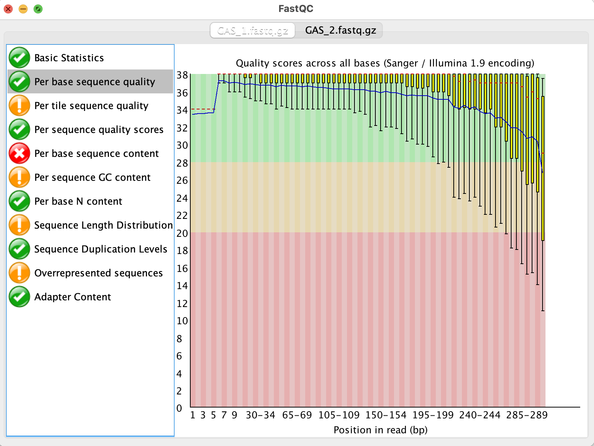

# Read Quality Control and Trimming

### April 24, 2023

*Egon A. Ozer, MD PhD (<e-ozer@northwestern.edu>)*  
*Ramon Lorenzo Redondo, PhD (<ramon.lorenzo@northwestern.edu>)* 

----

**Before we start:**

```Shell
conda activate asssembly
```

Using `cd`, navigate to the "demo_data" folder you downloaded today. 

You should see this as the output of your `ls` command:

```
Alignments    MLTrees       Phylodynamics reads         reference
```


## Section 1 - Read quality control with [FastQC](https://www.bioinformatics.babraham.ac.uk/projects/fastqc/)



FastQC provides quality metrics for read files and shows the output in graphical and text formats. 

_Commands_

```Shell
fastqc reads/GAS_1.fastq.gz reads/GAS_2.fastq.gz
```

_Outputs_

Files | Description
--- | ---
GAS_1_fastqc.html | Read characteristics in graphical format. Can be opened with a web browser like Chrome
GAS_1_fastqc.zip | Zip file containing results in text versions


More detailed information about how to interpret the results can be found in the manual: [https://www.bioinformatics.babraham.ac.uk/projects/fastqc/Help/](https://www.bioinformatics.babraham.ac.uk/projects/fastqc/Help/)

## Section 2 - Read trimming

Before we assemble, we'll do some very light read trimming. This step removes any Illumina adapter sequences that may have made it into the reads due to read-through of short library fragments. These adapter sequences can sometimes get incorporated into your assembly and cause misassemblies. Better to take the time to remove them prior to assembly. 

We are going to use [fastp](https://github.com/OpenGene/fastp) to perform the trimming step. Fastp can perform a number of functions including adapter removal as well remove low-quality sequences from the reads. 

_Commands_ 

```Shell
fastp \
    --in1 reads/GAS_1.fastq.gz \
    --in2 reads/GAS_2.fastq.gz \
    --out1 GAS_trimmed_paired_1.fastq.gz \
    --out2 GAS_trimmed_paired_2.fastq.gz \
    --unpaired1 GAS_trimmed_unpaired_1.fastq.gz \
    --unpaired2 GAS_trimmed_unpaired_2.fastq.gz \
    -h GAS_fastp.html \
    -j GAS_fastp.json \
    -w 1
```    
_Settings Used_

Setting | Descripton
--- | ---
`--in1 / --in2` | Input read files
`--out1 / --out2` |  Paired output read files
`--unpaired1 / --unpaired2` | Singleton read files (only one of the paired reads passed filters)  
`-h` | Filtering and trimming report, html format
`-j` | Filtering and trimming reoprt, json format
`-w` | Number of parallel threads to use
   

See [fastp manual](https://github.com/OpenGene/fastp/blob/master/README.md) for more detail on settings and other options.

_Outputs_

Files | Description
--- | ---
`GAS_trimmed_paired_1.fastq.gz` & `_2.fastq.gz` | Paired reads remaining after trimming
`GAS_trimmed_unpaired_1.fastq.gz` & `_2.fastq.gz` | Unpaired reads remaining after trimming 
`GAS_fastp.html` | Filtering and trimming report. Can view with Firefox or other web browser


---

# [Back to table of contents](../README.md)


---
1. <a rel="license" href="http://creativecommons.org/licenses/by-sa/4.0/"></a><br />This work is licensed under a <a rel="license" href="http://creativecommons.org/licenses/by-sa/4.0/">Creative Commons Attribution-ShareAlike 4.0 International License</a>.