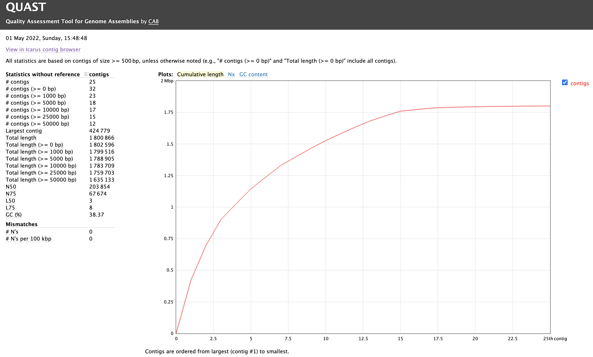

# Sequence assembly

### April 24, 2023

*Egon A. Ozer, MD PhD (<e-ozer@northwestern.edu>)*  
*Ramon Lorenzo Redondo, PhD (<ramon.lorenzo@northwestern.edu>)* 

----

## Section 1 - _De novo_ Assembly

Now we'll generate a _de novo_ whole genome assembly from our trimmed reads. For this we'll use the assembler [SPAdes](https://cab.spbu.ru/software/spades/) ([Github site](https://github.com/ablab/spades)).  

**Commands**

Activate conda environment if you haven't already 

```Shell
conda activate assembly
```

```Shell
spades.py \
    -o GAS_assembly \
    -1 GAS_trimmed_paired_1.fastq.gz \
    -2 GAS_trimmed_paired_2.fastq.gz \
    --cov-cutoff auto 
```

**Settings**

Setting | Descripton
--- | ---
`-o` | Name of the directory where the results will be output
`-1` & `-2` | Forward and reverse read paired-end files, respectively
`--cov-cutoff auto` | Remove contigs below a minimum amount of read coverage

See [SPAdes manual](https://cab.spbu.ru/files/release3.15.2/manual.html) for version 3.15.2 for more detail on available options.

>  **_Note:_** Usually when you are using SPAdes to perform an assembly you'll also want to use the `--careful` setting. This setting reduces mismatches and short indels by aligning reads back to the contigs to check for errors. We are only skipping it here to save processing time in the workshop.

**Outputs**

All of the output files can be found in the `GAS_assembly` folder. There are a lot of files in there, so we're just going to pick a few of the most relevant to describe.

Files | Description
--- | ---
`contigs.fasta` | Assembly contig sequences.
`scaffolds.fasta` | Scaffold sequnences. Scaffolds consist of contigs joined by N's at sites with paired reads support.
`spades.log` | Log file. Useful for troubleshooting poor or failed assemblies.
`assembly_graph.fasta` | Graph of assembly showing contig connections. May be useful for assembly quality assessment. Can be visualized with a graph viewer like [Bandage](https://rrwick.github.io/Bandage/)  

---

## Section 2 - Assembly statistics and quality assesment

After assembly you'll want some sense of the quality of the assembly. This usually includes, but is not limited to, the total number of contigs or scaffolds, the total length of the sequence, and the GC content. 

* Low numbers of contigs usually indicates a pretty good assembly where many unambiguous connections could be made. High numbers of contigs may indicate low read coverage or possible genome or read contamination from another source (though not always)
* Total contig length (sum of the lengths of all contigs) should be compared to the expected genome size of the species or organism. [NCBI Genome](https://www.ncbi.nlm.nih.gov/genome/) is a good source of expected genome sizes. 
* Percent GC content (i.e. the percentage of the sequence that is either cytosine or guanine bases) should also be compared to the expected genome GC content. 
* N50 is length of the contig such that contigs that length or longer account for >= 50% of the total assembly size. A small N50 value may indicate a more fragmented assembly.

A tool that can be used for calculating these values is [Quast](http://quast.sourceforge.net/quast.html). This software is available as either a command-line program or through an interactive website: <http://cab.cc.spbu.ru/quast/>. As the web version is intermittently down, we have already installed the command-line version with conda.

**Commands**

```Shell
quast GAS_assembly/contigs.fasta
```

**Settings**

Clearly there are not very many settings for the basic quast functionality, just the path to the contigs file.  

You can also use quast to compare to a closely related genome sequence using the `-r` setting to determine possible misassemblies. Just be warned that if your reference genome sequence is not very closely related, you may end up with a number of false-positive missassembly warnings. _Caveat emptor_. 

**Outputs**

By default, outputs will be put into a directory called "quast_results". Here are a few of the output files worth noting:

Files | Description
--- | ---
`report.html` | A report file that can be opened in a web browser like Chrome or Safari.
`report.pdf` | A pdf version of the assembly report
`report.tsv` | A tab-separated version of the report table that can be viewed in a spreadsheet program like Excel or in a text editor

Below is some example output from our assembly viewed in a web browser. 



FYI: The **N50** value is used to assess assembly contiguity. It is defined as the length of the shortest contig for which longer and equal length contigs cover at least 50% of the assembly.

---

# [Back to table of contents](../README.md)


---
<a rel="license" href="http://creativecommons.org/licenses/by-sa/4.0/"></a><br />This work is licensed under a <a rel="license" href="http://creativecommons.org/licenses/by-sa/4.0/">Creative Commons Attribution-ShareAlike 4.0 International License</a>.