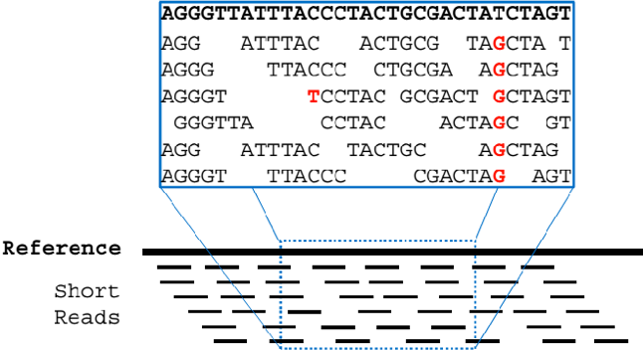
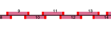
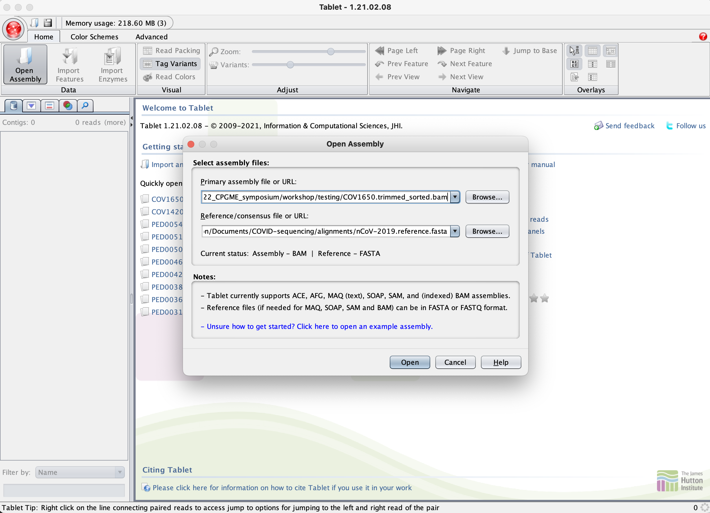
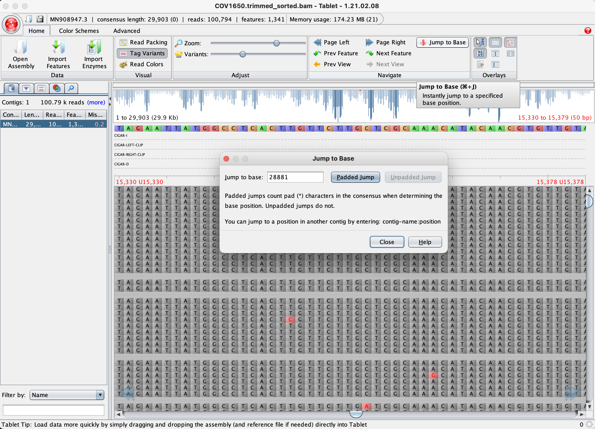
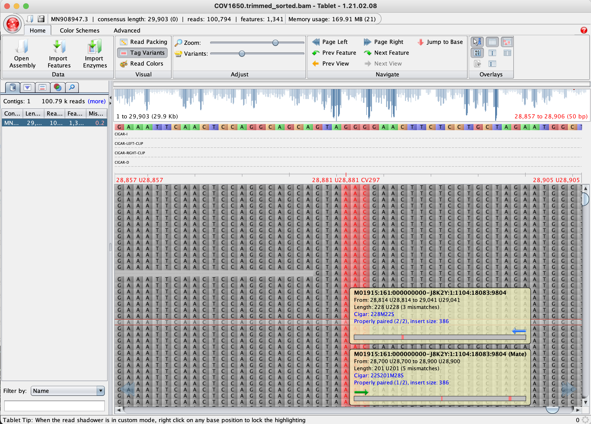

# Reference-based alignment

### April 24, 2023

*Egon A. Ozer, MD PhD (<e-ozer@northwestern.edu>)*  
*Ramon Lorenzo Redondo, PhD (<ramon.lorenzo@northwestern.edu>)*   

---

  

>Figure 1: Reference-based alignment example. From: _McVicar, Nathaniel et al. ArXiv [abs/1805.00106](https://doi.org/10.48550/arXiv.1805.00106) (2018)_

In this section we're going to perform reference-based alignments using the sequencing reads. Alignments can be more sensitive to identifying single nucleotide variants and small insertions or deletions. This is especially the case if you have repeated sequences or mixed populations as might be the case in some viral infections. Also, if your reference is very similar to your sequenced isolate, alignment can allow for greater confidence in variant calls and direct comparisons. 

## Section 1 - Bacterial alignment and variant calling with snippy

We'll start with alignment of the _S. pyogenes_ reads against the reference genome. [Snippy](https://github.com/tseemann/snippy) is a nice "all-in-one" pipeline for generating alignments and using those alignments to determine variants. If you supply a genbank file as the reference sequence, the program will also annnotate the variants, i.e. call synonymous, non-synonymous, or frameshift.

>  NOTE: On MacOS, the conda version of snippy is broken. To install manually if you have [HomeBrew](../part_1/1A_computer_preparation.md#step-3---mac-only-install-xcode-command-line-tools-and-homebrew): 
> 
> ```Shell
> brew install brewsci/bio/snippy
> brew install brewsci/bio/vt
> ```
> 
> If you don't have HomeBrew:
> 
> ```Shell
> git clone https://github.com/tseemann/snippy.git $HOME/snippy
> echo "export PATH=$HOME/snippy/bin:\$PATH" >> ~/.bashrc
> source ~/.bashrc
> snippy --check
> 
> ``` 
> 
> Then install the rest of items needed in the conda environment:
> 
> ```Shell
> conda create -n alignment ivar
> ``` 
>
> 

**Commands**

```Shell
conda activate alignment
```

```Shell
snippy \
	--outdir GAS_alignment \
	--reference reference/GAS_NGAS638.gbk \
	--R1 reads/GAS_1.fastq.gz \
	--R2 reads/GAS_2.fastq.gz \
	--cpus 1 \
	--ram 6
```

>  NOTE: If you have a newer version of MacOS, you may get an error right after this step in the process: 
> 
> ```
> Running: fasta_generate_regions.py reference/ref.fa.fai 607112 > reference/ref.txt 2>> snps.log
> ```
> If so, it's due to a small glitch in how brewcamp installs python3. Just run the following command to fix it:
> 
> ```Shell
> ln -s "$(brew --prefix)/bin/python"{3,}
> ```
> 
> Unfortunately, you may also have problems with vt if you have a newer Mac. As of this writing, the Brewcamp version of vt is broken for newer Macs. You can try to install vt from source using these instructions: [https://genome.sph.umich.edu/wiki/Vt#General](https://genome.sph.umich.edu/wiki/Vt#General)
> 

**Settings**

Setting | Description
--- | ---
`--outdir` | Name of the directory the output files will go into. You'll get an error if this directory already exists
`--reference` | Genome sequence to use as an alignment reference. Can be fasta or genbank file.
`--R1` & `--R2` | Paired-end read files
`--cpus` | Number of compute cores to use. The default is 8. I set it a bit lower in the example command to account for the variety of computers being used in the workshop. Generally you'll want to use all available cores for faster analysis. 
`--ram` | Limits RAM usage. The VirtualMachine has very limited RAM so we're limiting usagee here to 6 Gb. Usually you will not need to set this.  

For more detail on settings, visit <https://github.com/tseemann/snippy> or run `snippy --help`

**Outputs**

_Adapted from <https://github.com/tseemann/snippy>. Follow the link to see the full list of output files._

Extension | Description
----------|--------------
.tab | A simple [tab-separated](http://en.wikipedia.org/wiki/Tab-separated_values) summary of all the variants
.html | A [HTML](http://en.wikipedia.org/wiki/HTML) version of the .tab file for viewing in a web browser like Chrome or Safari
.bam | The alignments in [BAM](http://en.wikipedia.org/wiki/SAMtools) format. Includes unmapped, multimapping reads. Excludes duplicates.
.bam.bai | Index for the .bam file
.aligned.fa | A version of the reference but with `-` at position with `depth=0` and `N` for `0 < depth < --mincov` (**Note: snippy manual says this file "does not have variants," but in the current version 4.6.0 it does incorporate the single nucleotide variants**)
.consensus.fa | A version of the reference genome with *all* variants instantiated (substitutions and indels), but no masking of positions under minimum depth
.consensus.subs.fa | A version of the reference genome with *only substitution* variants instantiated, but no masking of positions under minimum depth
.log | A log file with the commands run and their outputs


## Section 2 - Viral alignment and variant calling with iVar

In this section we'll perform an alignment using a viral genome instead. This is somewhat different than the bacterial genome example above. For instance, the viral genome sequencing library was generated using overlapping PCR amplicons (Figure 2). This means some portions of the reads may contain the PCR primer binding sites which will have sequences matching the primer sequences rather than the sequence of the virus you are studying. Other portions of reads from a neighboring amplicon site will have the same regions sequenced but as they are between the primer sites, these sequences will reflect the true virus sequence (hopefully!). So we need to trim primer sequences from the reads after alignment to avoid missing variants.



> Figure 2. Representation of tiled amplicon sequencing strategy. Bright red small boxes are primer binding sites and darker red strips between them represent amplified sequences. 

In this example we'll perform alignment and variant calling of a SARS-CoV-2 viral genome.


### Step 2.1 

Align reads to the reference sequence using `bwa mem` and use `samtools view` and `samtools sort` to generate a sorted alignment file in the bam binary format. We're going to use piping (the `|` character) to send the output of one command directly into the input of the next command. This saves space and time. Just don't forget to include the `-` dash character in the next command to let the program know to expect its input is coming from the previous command. The last command `samtools index` creates a small index file (ending with `.bai`) that needs to be with the bam file in order for other programs to access it.

**Commands**

```Shell
bwa mem \
	reference/nCoV-2019.reference.fasta \
	reads/COV1650_1.fastq.gz \
	reads/COV1650_2.fastq.gz | \
	samtools view -bS -F 4 - | \
	samtools sort -o COV1650_sorted.bam -
samtools index COV1650_sorted.bam
```
**Settings**

`bwa` 

Setting | Description
--- | ---
`mem` | Use the BWA-MEM algorithm for the alignment. This is best for short reads produced by Illumina. 
\<reference file> | A reference sequence in fasta format. Usually you need to index the reference file using `bwa index <reference file>` before running the alignment, but we're providing a pre-indexed reference to save time.

See the bwa manual <http://bio-bwa.sourceforge.net/bwa.shtml> for more detail on settings. 

`samtools`

Command | Setting | Description
--- | --- | ---
`view` |`-b` | Output bam-formatted file
`view` | `-S` | Input is sam-formatted file
`view` | `-F` | Filter output. In this case '4' means do not output reads that don't have any alignments to the reference. This saves some disk space.
`sort` | `-o` | Name of the file to output

See the samtools manual <http://www.htslib.org/doc/samtools.html> for more detail on settings

**Outputs**

File | Description
--- | ---
COV1650_sorted.bam | Alignment file in bam binary format
COV1650_sorted.bam.bai | Alignment index file

### Step 2.2 

Trim amplification primers from the reads in the alignment using iVar. 

**Commands**

```Shell
ivar trim \
	-q 20 \
	-i COV1650_sorted.bam \
	-b reference/nCoV-2019.ivar.bed \
	-p COV1650.trimmed
samtools sort -o COV1650.trimmed_sorted.bam COV1650.trimmed.bam
samtools index COV1650.trimmed_sorted.bam
```

**Settings**

`ivar`

Command | Setting | Description
--- | --- | ---
`trim` | `-q` | Minimum sliding window quality threshold
`trim` | `-i` | Input alignment file, in bam format
`trim` | `-b` | File containing coordiinates of primer binding sites along the reference genome, in [BED](https://en.wikipedia.org/wiki/BED_(file_format)) format. 
`trim` | `-p` | Prefix of output files

Review the iVar manual <https://andersen-lab.github.io/ivar/html/manualpage.html> if you want more detail about commands and settings.

**Outputs**

File | Description
--- | ---
COV1650_trimmed_sorted.bam | Alignment file in bam binary format with primer sequences trimmed from reads
COV1650_trimmed_sorted.bam.bai | Alignment index file

### Step 2.3

Use iVar to generate a table of variants as well as a consensus genome sequence. We'll first use `samtools mpileup` to generate a [pileup file](http://samtools.sourceforge.net/pileup.shtml) of read base calls at each position along the reference. This pileup file will be used as input to iVar.

**Commands**

_Command 2.3.1_: Generate pileup file

```Shell
samtools mpileup \
	-aa \
	-A \
	-d 0 \
	-Q 0 \
	--reference reference/nCoV-2019.reference.fasta \
	COV1650.trimmed_sorted.bam \
	> COV1650.pileup.txt
```

_Command 2.3.2_: Call variants based on pileup output

```Shell
ivar variants \
	-p COV1650.variants \
	-t 0.03 \
	< COV1650.pileup.txt
```

_Command 2.3.3_: Generate consenus sequence based on pileup output

```Shell
ivar consensus \
	-m 10 \
	-q 20 \
	-t 0 \
	-p COV1650.consensus \
	< COV1650.pileup.txt
```
**Settings**

`samtools mpileup`

Setting | Description
--- | ---
`-aa` | Output base calls at absolutely all genome positions, even those with no aligned reads
`-A` | Do not discard anomalous pairs, i.e. pairs of reads where only one aligned to the reference
`-d` | Maximmum read depth. Setting to '0' disables limit
`-Q` | Minimum read base quality. Setting to '0' disables limit. We're going to filter in iVar.
`--reference` | Reference genome sequence, in fasta format

`ivar`

Command | Setting | Description
--- | --- | ---
`variants` | `-p` | Output file prefix 
`variants` | `-t` | Minimum frequence threshold to call variants. '0.03' means at least 3% of reads covering a position must be different than the reference base to be output. 
`consensus` | `-m` | Minimum read depth to call consenus
`consensus` | `-q` | Minimum quality score threshold to count base
`consensus` | `-t` | Minim frequency threshold to call consensus. '0' means that the most common base at a position will be called the consensus.
`consensus` | `-p` | Output file prefix

**Outputs**:

File | Description
--- | ---
COV1650.variants.tsv | Tab-delmited file showing variants and their read support
COV1650.consensus.fa | Consensus genome sequence including all variants passing filters

You can view in the variants.tsv file in your terminal using `less COV1650.variants.tsv` or in a text editor or you can open it in Excel. These are the columns in the file:

1. REGION: Reference sequence name
2. POS: Position in the reference
3. REF: Base in the reference sequence
4. ALT: Base in the sequenced genome (ALTernate)
5. REF_DP: Number of reads with the reference base
6. REF_RV: Number of reference base reads aligning in the reverse orientation
7. REF_QUAL: Average quality of the reference bases
8. ALT_DP: Number of reads with the alternate base
9. ALT_RV: Number of alternate bases on reverse reads
10. ALT_QUAL: Average quality of the alternate bases
11. ALT_FREQ: Frequency (proportion) of the alternate base
12. TOTAL_DP: Total read depth at this position
13. PVAL: p-value of Fisher's exact test
14. PASS: "True" if p-value <= 0.05

The file also includes the columns "GFF_FEATURE", "REF_CODON", "REF_AA", "ALT_CODON", and "ALT_AA" but these will be empty because we didn't give any annotation information to `ivar variants`. 

## Section - 3 Viewing alignments with Tablet 

You can look at bam-formatted alignment files right in your Terminal using the command `samtools view COV1650.trimmed.sorted.bam | less`. Make sure you're piping the output to `less` or else you'll fill your Terminal with thousands of lines. Just a little hint if this happens: you can interrupt a process in your Terminal before it finishes using the _Ctrl-C_ keys.

An easier way to visualize aligments in bam files is using a program like Tablet:

1. Open Tablet and use the "Open Assembly" button in the to left to select your files. To view an alignment file, you'll need to give Tablet two files: 1) the alignment bam file,  COV1650.trimmed.sorted.bam (make sure its .bai index file is in the same directory as the .bam file) and 2) the reference fasta sequence we used, nCoV-2019.reference.fasta.

    

2. Once loaded, select the sequence you want to view in the left bar. Since our reference file only had one sequence, there is only one entry in the list.
3. Let's examine one variant location from the variants file. There were three variants identified from postions 28,881 to 28,883. You could drag the window over to this position, but it's easier to use the "Jump to Base" function in the top bar. Select "Jump to Base", type "28881" into the box, and click "Padded Jump".  

    

4. Make sure you have the "Tag Variants" coloring scheme selected in the "Visual" portion of the top bar to quickly see variants in the aligned reads relative to the reference sequence.

    


Using Tablet can be helpful for quickly visualizing and validating important or suspicious variants in read alignments. 

---

# [Back to table of contents](../README.md)

---

<a rel="license" href="http://creativecommons.org/licenses/by-sa/4.0/"></a><br />This work is licensed under a <a rel="license" href="http://creativecommons.org/licenses/by-sa/4.0/">Creative Commons Attribution-ShareAlike 4.0 International License</a>.